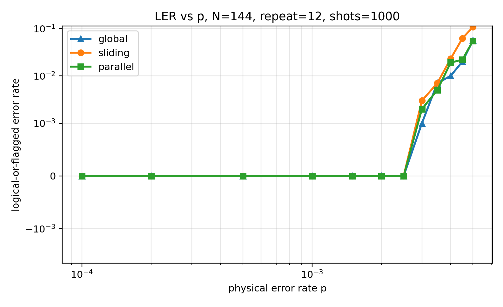
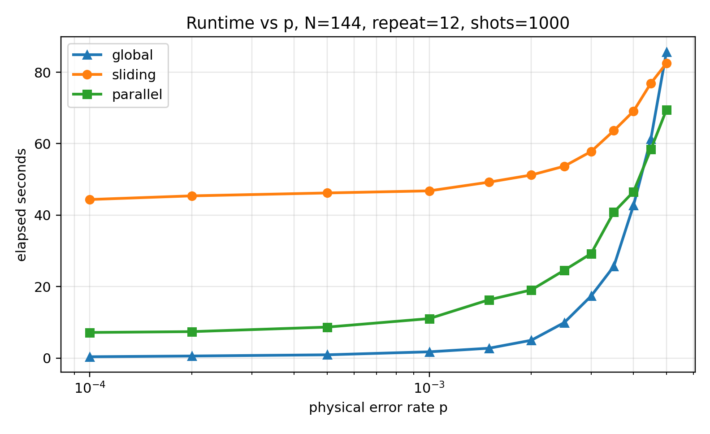
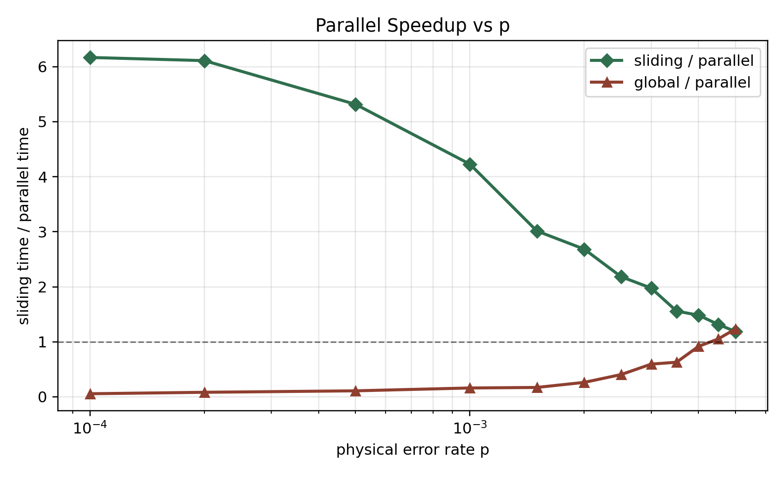

# Parallel Window Decoder 优化记录

本文记录从最初的 A/B parallel window 实现，到最终采用

```text
a_size = 3
a_solve_size = 9
b_width = 3
parallel_backend = process
parallel_workers = 4
```

这一版本之间的主要问题、尝试和实验结果。

实验默认使用 BP+OSD：

```text
osd_order = 10
max_iter = 200
```

正式对比中的 sliding baseline 已迁移 `SlidingWindowDecoder/osd.py` 的核心逻辑，包括：

```text
anchors
method=1 noisy syndrome / virtual boundary columns
非最后窗口只 commit 左边 F=1 block
residual update
```

因此后续的 sliding 结果是正式 OSD sliding baseline，而不是早期的简化版本。

---

## 1. 初始 A/B Parallel Window

最初的 staggered A/B 排布为：

```text
A1: s1-s2
B1: s2-s4
A2: s4-s6
B2: s6-s8
A3: s8-...
```

对应：

```text
a_size = 3
a_solve_size = 3
b_width = 3
```

即 A window 解多少就 commit 多大的边界区域。以 A2 为例：

```text
A2 solve:  s4-s6
A2 commit: e7,e8,e9
```

### 100-shot 结果

文件：

```text
ParallelWindowDecoder/results/N144_repeat12_shots100_ab_window_results_fixed_sliding.csv
```

参数：

```text
N = 144
num_repeat = 12
num_shots = 100
p = 0.003, 0.004, 0.005
```

| p | decoder | LER | flagged | elapsed |
|---|---|---:|---:|---:|
| 0.003 | sliding | 0.00 | 0/100 | 5.846s |
| 0.003 | parallel | 0.19 | 19/100 | 2.666s |
| 0.003 | oracle | 0.00 | 0/100 | 0.548s |
| 0.004 | sliding | 0.05 | 0/100 | 7.140s |
| 0.004 | parallel | 0.49 | 49/100 | 4.066s |
| 0.004 | oracle | 0.00 | 0/100 | 0.684s |
| 0.005 | sliding | 0.15 | 0/100 | 8.461s |
| 0.005 | parallel | 0.61 | 57/100 | 5.261s |
| 0.005 | oracle | 0.01 | 0/100 | 0.797s |

### 结论

初始 parallel 的 flagged 很高，但 oracle 基本闭合。

这说明：

```text
B window residual 方程和 A/B 排布是对的；
问题主要来自 A 层 decoded boundary 不可靠。
```

也就是说，如果 A 层给出正确边界，B 层可以闭合；但 A window 自己太小，commit 变量贴着窗口边界，容易受到窗口外 syndrome 污染。

---

## 2. 尝试一：A Window 加 Noisy Boundary Columns

我们尝试给 A window 加左右 noisy boundary columns：

```text
A_noisy = [A | I_left | I_right]
```

这些虚拟列只用于 A 局部解码，不写回全局解。

命令参数：

```text
--a-noisy-boundary
```

### 100-shot 结果

文件：

```text
ParallelWindowDecoder/results/N144_repeat12_shots100_parallel_a_noisy_boundary.csv
```

| p | parallel LER | flagged | elapsed |
|---|---:|---:|---:|
| 0.003 | 0.17 | 17/100 | 2.677s |
| 0.004 | 0.48 | 48/100 | 4.153s |
| 0.005 | 0.64 | 60/100 | 5.439s |

对比无 noisy boundary：

| p | no noisy LER | noisy LER |
|---|---:|---:|
| 0.003 | 0.19 | 0.17 |
| 0.004 | 0.49 | 0.48 |
| 0.005 | 0.61 | 0.64 |

### 结论

简单 identity noisy boundary columns 改善很小，高噪声点甚至略差。

这说明 A 层问题不只是局部 syndrome 边界能否被虚拟变量吸收，而是 commit 变量本身离窗口边界太近。

---

## 3. 尝试二：A Solve Window 更大，但 Commit Window 不变

核心思想：

```text
A solve window 更大
A commit window 仍保持原来的 3
```

即引入：

```text
a_size = A commit size
a_solve_size = A solve size
```

例如：

```text
a_size = 3
a_solve_size = 5
```

则中间 A2 从：

```text
A2 solve:  s4-s6
A2 commit: e7,e8,e9
```

变为：

```text
A2 solve:  s3-s7
A2 commit: e7,e8,e9
```

B window 不变：

```text
B1: s2-s4
B2: s6-s8
```

这样 commit 变量从 A solve window 的边缘移动到了更内部的位置。

---

## 4. a_solve_size = 5

命令核心参数：

```text
--a-size 3
--a-solve-size 5
```

### 100-shot 结果

文件：

```text
ParallelWindowDecoder/results/N144_repeat12_shots100_ab_window_a_solve5_commit3.csv
```

| p | decoder | LER | flagged | elapsed |
|---|---|---:|---:|---:|
| 0.003 | sliding | 0.00 | 0/100 | 5.945s |
| 0.003 | parallel | 0.02 | 2/100 | 4.190s |
| 0.004 | sliding | 0.05 | 0/100 | 7.197s |
| 0.004 | parallel | 0.11 | 10/100 | 5.771s |
| 0.005 | sliding | 0.15 | 0/100 | 8.322s |
| 0.005 | parallel | 0.32 | 29/100 | 7.961s |

### 结论

相比初始 `a_solve_size=3`，flagged 大幅下降：

| p | a_solve=3 flagged | a_solve=5 flagged |
|---|---:|---:|
| 0.003 | 19/100 | 2/100 |
| 0.004 | 49/100 | 10/100 |
| 0.005 | 57/100 | 29/100 |

这验证了：

```text
A boundary 可靠性主要受 solve window buffer 影响。
```

---

## 5. a_solve_size = 5 + A Noisy Boundary

我们又尝试将 `a_solve_size=5` 与 `--a-noisy-boundary` 结合。

文件：

```text
ParallelWindowDecoder/results/N144_repeat12_shots100_parallel_a_solve5_commit3_noisy_boundary.csv
```

| p | parallel LER | flagged | elapsed |
|---|---:|---:|---:|
| 0.003 | 0.02 | 2/100 | 4.287s |
| 0.004 | 0.12 | 11/100 | 6.070s |
| 0.005 | 0.32 | 29/100 | 8.251s |

对比不加 noisy boundary：

| p | solve5 | solve5 + noisy |
|---|---:|---:|
| 0.003 | 0.02 | 0.02 |
| 0.004 | 0.11 | 0.12 |
| 0.005 | 0.32 | 0.32 |

### 结论

在当前实现中，noisy boundary 对 `a_solve=5` 基本无增益。后续主要沿着增大 `a_solve_size` 优化。

---

## 6. a_solve_size = 7

命令核心参数：

```text
--a-size 3
--a-solve-size 7
```

### 100-shot 结果

文件：

```text
ParallelWindowDecoder/results/N144_repeat12_shots100_parallel_a_solve7_commit3.csv
```

| p | parallel LER | flagged | elapsed |
|---|---:|---:|---:|
| 0.003 | 0.00 | 0/100 | 6.344s |
| 0.004 | 0.01 | 0/100 | 9.612s |
| 0.005 | 0.10 | 8/100 | 13.032s |

### 100-shot 与 Sliding 对比

文件：

```text
ParallelWindowDecoder/results/N144_repeat12_shots100_sliding_vs_parallel_process_workers4.csv
```

此处 parallel 已使用多进程：

```text
--parallel-workers 4
--parallel-backend process
```

| p | decoder | LER | flagged | elapsed | speedup |
|---|---|---:|---:|---:|---:|
| 0.003 | sliding | 0.00 | 0/100 | 5.923s | - |
| 0.003 | parallel | 0.00 | 0/100 | 3.980s | 1.49x |
| 0.004 | sliding | 0.05 | 0/100 | 7.170s | - |
| 0.004 | parallel | 0.01 | 0/100 | 5.418s | 1.32x |
| 0.005 | sliding | 0.15 | 0/100 | 8.347s | - |
| 0.005 | parallel | 0.10 | 8/100 | 7.401s | 1.13x |

### 1000-shot 与 Sliding 对比

文件：

```text
ParallelWindowDecoder/results/N144_repeat12_shots1000_sliding_vs_parallel_a_solve7.csv
```

| p | decoder | LER | flagged | elapsed | speedup |
|---|---|---:|---:|---:|---:|
| 0.003 | sliding | 0.003 | 0/1000 | 57.838s | - |
| 0.003 | parallel | 0.003 | 2/1000 | 66.052s | 0.88x |
| 0.004 | sliding | 0.023 | 0/1000 | 69.179s | - |
| 0.004 | parallel | 0.034 | 25/1000 | 98.458s | 0.70x |
| 0.005 | sliding | 0.107 | 0/1000 | 82.826s | - |
| 0.005 | parallel | 0.132 | 89/1000 | 131.736s | 0.63x |

注意：这份 1000-shot `a_solve=7` 结果是早期串行 parallel 路径，不是 process backend。因此速度不代表最终多进程版本。

### 结论

`a_solve=7` 在 100-shot 上已经接近或优于 sliding，但 1000-shot 下仍存在 flagged，且早期串行版本速度较慢。

---

## 7. 实现真实并行

随后代码实现了真正两层并行：

```text
A layer: A1,A2,A3,... 并行
residual update
B layer: B1,B2,B3,... 并行
```

新增参数：

```text
--parallel-workers 4
--parallel-backend process
```

`thread` 后端可在沙箱内运行，但加速不明显。`process` 后端是真正多进程并行，可以绕过 Python GIL，但在当前环境中需要非沙箱权限。

### a_solve=7, 100-shot, process backend

文件：

```text
ParallelWindowDecoder/results/N144_repeat12_shots100_parallel_a_solve7_process_workers4.csv
```

| p | LER | flagged | serial elapsed | process elapsed | speedup |
|---|---:|---:|---:|---:|---:|
| 0.003 | 0.00 | 0/100 | 6.344s | 4.045s | 1.57x |
| 0.004 | 0.01 | 0/100 | 9.612s | 5.452s | 1.76x |
| 0.005 | 0.10 | 8/100 | 13.032s | 7.334s | 1.78x |

### 结论

真实多进程并行能带来明显 wall-clock 加速。没有达到 4x 的原因包括：

```text
1. A/B window 数量有限；
2. 每层内部最多只能并行该层窗口数；
3. 进程启动和矩阵数据传输有开销；
4. residual update 仍是同步步骤。
```

---

## 8. a_solve_size = 9

继续增大 A solve window：

```text
--a-size 3
--a-solve-size 9
```

### 100-shot 与 Sliding 对比

文件：

```text
ParallelWindowDecoder/results/N144_repeat12_shots100_sliding_vs_parallel_a_solve9_process_workers4.csv
```

| p | decoder | LER | flagged | elapsed |
|---|---|---:|---:|---:|
| 0.003 | sliding | 0.00 | 0/100 | 5.877s |
| 0.003 | parallel | 0.00 | 0/100 | 4.470s |
| 0.004 | sliding | 0.05 | 0/100 | 7.103s |
| 0.004 | parallel | 0.01 | 0/100 | 5.845s |
| 0.005 | sliding | 0.15 | 0/100 | 8.261s |
| 0.005 | parallel | 0.03 | 0/100 | 8.653s |

### 1000-shot 与 Sliding 对比

文件：

```text
ParallelWindowDecoder/results/N144_repeat12_shots1000_sliding_vs_parallel_a_solve9_process_workers4.csv
```

| p | decoder | LER | flagged | elapsed | speedup |
|---|---|---:|---:|---:|---:|
| 0.003 | sliding | 0.003 | 0/1000 | 57.811s | - |
| 0.003 | parallel | 0.002 | 0/1000 | 29.255s | 1.98x |
| 0.004 | sliding | 0.023 | 0/1000 | 69.084s | - |
| 0.004 | parallel | 0.019 | 0/1000 | 46.568s | 1.48x |
| 0.005 | sliding | 0.107 | 0/1000 | 82.476s | - |
| 0.005 | parallel | 0.055 | 0/1000 | 69.439s | 1.19x |

### 结论

`a_solve_size=9` 是目前最好的设置：

```text
1. parallel flagged 全部降为 0/1000；
2. parallel LER 在三个 p 点都低于 sliding；
3. parallel wall-clock 在三个 p 点都快于 sliding；
4. 高噪声点 p=0.005 的 LER 从 sliding 的 0.107 降到 parallel 的 0.055。
```

---

## 9. 总体结论

### 9.1 初始理论是否成立

oracle 实验表明：

```text
若 A 层边界变量正确，B 层 residual 方程可以闭合。
```

因此 A/B 拆分的代数结构和并行性来源是成立的。

### 9.2 初始失败原因

初始 `a_solve=a_size=3` 时，A commit 变量太靠近 A window 边界：

```text
A2 solve:  s4-s6
A2 commit: e7,e8,e9
```

导致 A 层边界变量容易被窗口外 syndrome 污染。

### 9.3 最有效优化

最有效的优化是：

```text
A solve window 更大，但 commit window 不变。
```

即：

```text
a_size = 3
a_solve_size = 9
```

这让 commit 变量位于 A solve window 的内部，从而显著提高边界可靠性。

### 9.4 Noisy Boundary 的作用

当前简单 identity noisy boundary columns 改善不明显。后续如果继续研究 noisy boundary，需要设计更贴近 `SlidingWindowDecoder` method=1 的 prior 和边界结构，而不是简单左右 identity。

### 9.5 并行加速

多进程后端实现后，A 层和 B 层分别并行执行：

```text
A windows parallel
residual update
B windows parallel
```

最终在 `N=144,num_repeat=12,num_shots=1000` 下：

```text
p=0.003 speedup ≈ 1.98x
p=0.004 speedup ≈ 1.48x
p=0.005 speedup ≈ 1.19x
```

加速随 p 升高下降，主要因为高 p 下局部 BP+OSD 的工作量和进程通信开销占比变化。

---

## 10. 推荐当前默认实验命令

```bash
SlidingWindowDecoder/.conda-gdg/bin/python ParallelWindowDecoder/run_experiments.py \
  --N 144 \
  --p-list 0.003,0.004,0.005 \
  --num-repeat 12 \
  --num-shots 1000 \
  --a-size 3 \
  --a-solve-size 9 \
  --b-width 3 \
  --osd-order 10 \
  --max-iter 200 \
  --decoders sliding,parallel \
  --parallel-workers 4 \
  --parallel-backend process \
  --out ParallelWindowDecoder/results/N144_repeat12_shots1000_sliding_vs_parallel_a_solve9_process_workers4.csv
```

当前推荐配置：

```text
a_size = 3
a_solve_size = 9
b_width = 3
parallel_workers = 4
parallel_backend = process
```

---

## 11. 扩展 p 范围：\(10^{-4}\) 到 0.005

为了更完整地观察最终配置在低噪声到中等噪声区间的表现，进一步增加了 p 的采样范围：

```text
p = 0.0001, 0.0002, 0.0005,
    0.001, 0.0015, 0.002, 0.0025,
    0.003, 0.0035, 0.004, 0.0045, 0.005
```

参数保持：

```text
N = 144
num_repeat = 12
num_shots = 1000
a_size = 3
a_solve_size = 9
b_width = 3
osd_order = 10
parallel_workers = 4
parallel_backend = process
```

合并后的 CSV：

```text
ParallelWindowDecoder/results/N144_repeat12_shots1000_global_sliding_parallel_a_solve9_dense_p1e-4_to_0.005.csv
```

### 11.1 密集 p 扫描结果

本节加入 direct/global BP+OSD 作为第三个 baseline。

| p | global LER | sliding LER | parallel LER | global time | sliding time | parallel time | sliding/parallel | global/parallel |
|---:|---:|---:|---:|---:|---:|---:|---:|---:|
| 0.0001 | 0 | 0 | 0 | 0.405s | 44.391s | 7.199s | 6.17x | 0.06x |
| 0.0002 | 0 | 0 | 0 | 0.613s | 45.409s | 7.433s | 6.11x | 0.08x |
| 0.0005 | 0 | 0 | 0 | 0.950s | 46.219s | 8.696s | 5.31x | 0.11x |
| 0.001 | 0 | 0 | 0 | 1.782s | 46.806s | 11.072s | 4.23x | 0.16x |
| 0.0015 | 0 | 0 | 0 | 2.787s | 49.242s | 16.338s | 3.01x | 0.17x |
| 0.002 | 0 | 0 | 0 | 5.017s | 51.240s | 19.095s | 2.68x | 0.26x |
| 0.0025 | 0 | 0 | 0 | 9.951s | 53.694s | 24.597s | 2.18x | 0.40x |
| 0.003 | 0.001 | 0.003 | 0.002 | 17.384s | 57.811s | 29.255s | 1.98x | 0.59x |
| 0.0035 | 0.007 | 0.007 | 0.005 | 25.697s | 63.640s | 40.849s | 1.56x | 0.63x |
| 0.004 | 0.01 | 0.023 | 0.019 | 42.728s | 69.084s | 46.568s | 1.48x | 0.92x |
| 0.0045 | 0.02 | 0.062 | 0.022 | 61.311s | 76.906s | 58.406s | 1.32x | 1.05x |
| 0.005 | 0.056 | 0.107 | 0.055 | 85.629s | 82.476s | 69.439s | 1.19x | 1.23x |

这里：

```text
sliding/parallel = sliding elapsed / parallel elapsed
global/parallel  = global elapsed / parallel elapsed
```

数值大于 1 表示 parallel 更快；小于 1 表示对应 baseline 更快。

### 11.2 图表

#### LER vs p



#### Runtime vs p



#### Parallel Speedup vs p



### 11.3 观察

1. 在整个 \(10^{-4}\) 到 0.005 的范围内，global、sliding、parallel 的 flagged 都是：

```text
0/1000
```

这说明 `a_solve_size=9` 已经足够稳定地解决了 A 层边界可靠性问题。

2. 在低 p 区间，三者 LER 都为 0。此时 global direct 解码最快，parallel 明显快于 sliding：

```text
p=0.0001 sliding/parallel ≈ 6.17x
p=0.0002 sliding/parallel ≈ 6.11x
p=0.0005 sliding/parallel ≈ 5.31x
```

3. 随着 p 增大，parallel 相对 sliding 的加速比下降，但仍保持快于 sliding：

```text
p=0.003 sliding/parallel ≈ 1.98x
p=0.004 sliding/parallel ≈ 1.48x
p=0.005 sliding/parallel ≈ 1.19x
```

4. 相对 global，parallel 在低 p 时更慢，因为 global BP+OSD 很容易收敛；但随着 p 增大，global 成本快速上升，在高 p 处 parallel 开始快于 global：

```text
p=0.0045 global/parallel ≈ 1.05x
p=0.005  global/parallel ≈ 1.23x
```

5. 在较高 p 区间，parallel 的 LER 低于 sliding，并接近 global：

```text
p=0.0045 sliding LER = 0.062, parallel LER = 0.022
p=0.005  sliding LER = 0.107, parallel LER = 0.055
p=0.005  global  LER = 0.056, parallel LER = 0.055
```

这表明扩大 A solve window 后，parallel window 不只是获得并行速度收益，也在该实验设置下获得了接近 direct/global 解码的性能。

### 11.4 当前最佳结论

当前最优实验配置为：

```text
a_size = 3
a_solve_size = 9
b_width = 3
parallel_workers = 4
parallel_backend = process
```

在 `N=144,num_repeat=12,num_shots=1000` 下，该配置相对于正式 sliding OSD baseline：

```text
1. 全 p 范围 flagged = 0/1000；
2. 在低 p 区间显著更快；
3. 在高 p 区间 LER 更低；
4. 在所有测试点 wall-clock 都快于 sliding。
```

相对于 global direct BP+OSD：

```text
1. 低 p 时 global 更快；
2. 高 p 时 parallel 开始更快；
3. LER 在高 p 处接近 global，且明显优于 sliding。
```

